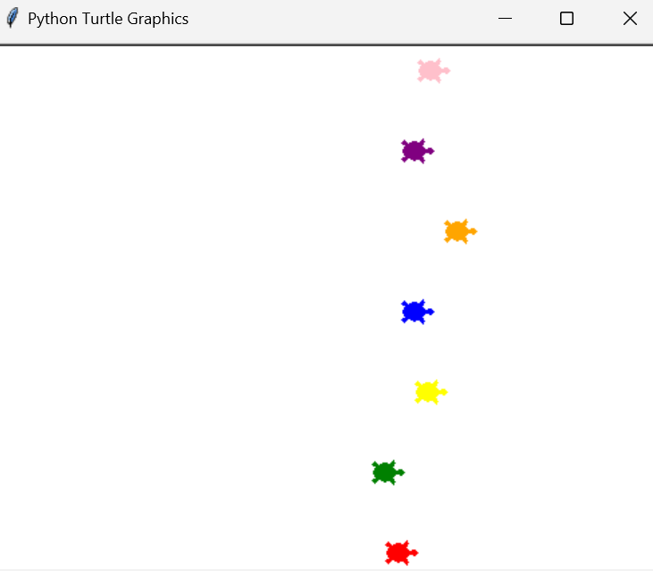

# Turtle Race Game 🐢🏁

Welcome to the Turtle Race Game! 🚀

## Overview

This Python script uses the Turtle graphics library to simulate an exciting turtle race. You can choose the number of turtles to participate in the race and place your bet on the winning turtle.

## How to Play 🎮

1. Run the script.
2. Enter the number of turtles you want in the race (maximum: 10).
3. Choose a turtle color to place your bet.
4. Watch the turtles race to the finish line!
5. Find out if you won or lost.
6. Choose to play again or exit.

## Code Features 🚀

- Customizable number of turtles.
- Dynamic turtle creation with random colors.
- User-friendly input prompts.
- Exciting race animation.

## Dependencies 📦

- Python 3.x
- Turtle graphics library

## Screenshot 📸




## Example Usage 🐢🏁

```python
import turtle
from turtle_race import create_turtles, start_race, get_user_input

while True:
    user_input = get_user_input()
    turtle_list = create_turtles(user_input[0])
    winner = start_race(turtle_list, user_input[1])
    title = winner[0]
    message = winner[1]
    play = turtle.textinput(title=title,
                            prompt=f"{message}. Do you want to play the game again? Type 'yes' or 'no': ")
    if play.lower() == 'no':
        turtle.bye()
    else:
        turtle.clearscreen()
```

## Customization 🎨
Feel free to customize the code to add more features or modify the appearance of the turtles. Experiment with different colors, turtle shapes, or race parameters!

Have fun and enjoy the turtle race! 🎉